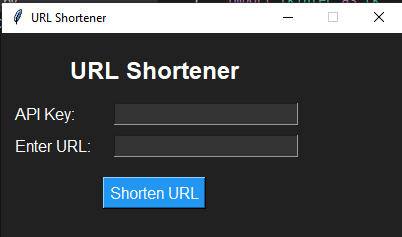

# URL Shortener

URL Shortener is a Python desktop application that utilizes the Cutt.ly URL shortening service to quickly and easily shorten long URLs. It features a user-friendly graphical interface built with the Tkinter library.



## Features

- Shorten long URLs using the Cutt.ly API.
- Requires a valid API key for authentication.
- Provides instant feedback on successful or failed URL shortening.

## Getting Started

### Prerequisites

- Python 3.x
- Required libraries can be installed using the following command:

  ```bash
  pip install requests
  ```

  ## How to Use??
  
  - Get your API key from cuttly
  - Input the API key and website link you want to shorten
  - Click on shorten URL
  - Copy the new URl that you can use
